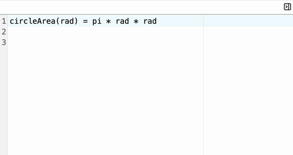

# Noteberry 🍓

- A notepad calculator that assists you to think, store and share calculations
- I built this editor as this is the product I want to use myself, it's a calculator wrapped inside a notepad interface.
- It does math operations, defines functions and stores results in values
- A function is a block of expression that can be evaluated as a single unit
- A function takes an input and results in an output, which are both evaluated to a mathematical value

## Inspiration

- This is a passion project of mine, having used multiple calculators and notepads, I wanted to combine the two into a single application that can be used to store and share calculations.
- I have tried a couple of applications that do the same thing, but there is always something missing.
- A calculator should be
  - easy to follow
  - reusable so you can reuse calculations from the other day
  - share your calculations to a friend
  - have tools to do more than just do simple BODMAS calculations
- Hopefully this project grows to reflect what I always believed a modern day calculator should be.

## Terms

We'll be using these terms to describe the application.

- Notepad, the whole application and it's state
- Note, a block of text that represents a page in the notepad
- Line, a single line of text in a page
- Evaluation, the process of evaluating a math expression or javascript function
- Result, the resulting data representation of an evaluation of either a line or a page
- Output, the visual representation of a result

## Roadmap

1. [x] Evaluating Math Expressions
2. [ ] Performing pre-defined actions as directives
3. [ ] Saving and loading pages locally on the users device
4. [ ] Saving and loading pages remotely on a server
5. [ ] Exporting page and result in multiple formats (HTML, PDF, etc.)
6. [ ] Defining and calling javascript functions
7. [ ] Exposing javascript functions inside a page as an module that can be reused inside another page
8. [ ] Sharing pages with other users

## Contribution

For contributing to this project, please refer to the [CONTRIBUTING.md](CONTRIBUTING.md) file.
